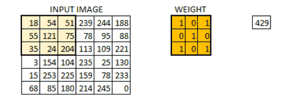
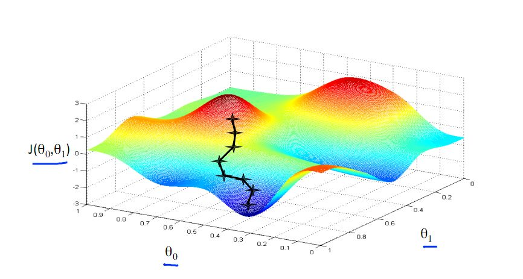
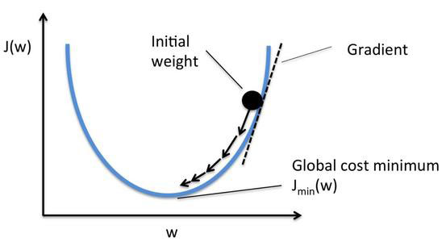

# CNN simple demo（Client and Server）
  当你创建完成一个CNN算法之后，你或许以为你学习的机器学习就是要面对一大堆很难分析的数据然后通过cost来评判一个模型是否是一个好的模型。其实不然，一个没有实际用处的模型，即使它无比的精准（不一定是精准，请了解偶合和欠偶合的概念），也无法作为你学习机器学习的乐趣吧。

  所以，不妨大胆试试，把一个简单的demo搭建到服务器，然后通过客户端访问，来完成第一个 Machine Learning 作品给小伙伴们看看吧。  
#### 在看这篇文章之前，你需要了解的知识：
1. 如何创建一个简单的CNN算法
2. 使用TensorFlow完成了一次模型的保存
3. 一些简单的前后端知识（jq无敌，php是最好的语言这个水平就够了）  

#### 还未了解过CNN的同学可以先阅读以上的文章。
[使用TensorFlow建立一个卷积神经网络（CNN）](https://zhuanlan.zhihu.com/p/30911463)  

### 安装依赖（use python 3.6）

#### 服务器环境使用的是 flask
  
  `pip install flask`
  
#### 图形处理库 Poillow
  whl安装地址：[https://www.lfd.uci.edu/~gohlke/pythonlibs/#pillow](https://www.lfd.uci.edu/~gohlke/pythonlibs/#pillow)  

  `pip install pillow or pip install xxx.whl`

#### 运行 cnn.py 创建一个模型 （run cnn.py to create a number OCR model）
  
  `python cnn.py or run cnn.bat`
  
#### 运行服务器 server.py （run server.py）
  
  `python server.py or run server.bat`

# Convolutional Neural Networks (卷积神经网络)

### 术语罗列  

>Convolutional layer 卷积层

>FeatureMap 特征平面
  
>pooling layer 池化层

### 简介
&nbsp;&nbsp;受Hubel和Wiesel对猫视觉皮层电生理研究启发，有人提出卷积神经网络（CNN），近年来卷积神经网络在多个方向持续发力，在语音识别、人脸识别、通用物体识别、运动分析、自然语言处理甚至脑电波分析方面均有突破。

  
### 卷积神经网络原理
-   神经网络
-   含有隐含层的神经网络
-   卷积神经网络

#### 1.卷积层基本工作原理

#### 2.神经网络

##### 其中x代表神经元信号（对应传入训练样本）w代表弱化权重（对应权重向量）

##### 迭代训练（梯度下降）

#### 4.本实例图像处理的技巧

